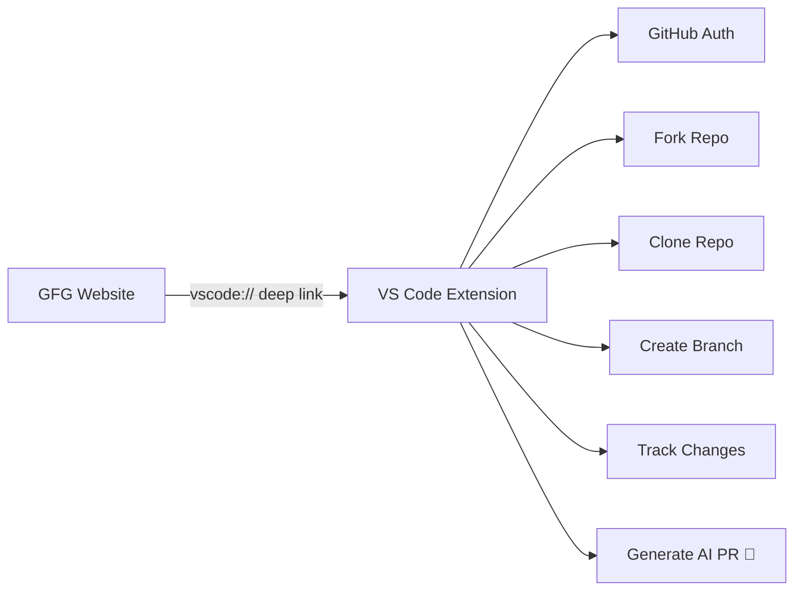

# 🚀 GFG – Good First Guide

**Empowering Beginners to Conquer Open Source – One Contribution at a Time!** 🌟

[](https://choosealicense.com/licenses/mit/)
[](https://github.com/RahulSingh044/Good-First-Guide/issues)

GFG is your intelligent companion for diving into open source! It seamlessly connects you to beginner-friendly issues, automates the tedious setup, and even uses AI to craft polished pull requests. No more getting stuck on "where to start" – just pure coding joy! 💻✨

---

## 🧠 Why GFG? The Open Source Struggle is Real...

Many aspiring developers want to contribute to open source but hit roadblocks:

- 📉 **Finding truly beginner-friendly issues**
- 😩 **Complicated repo setup** (forking, cloning, branching)
- ✍️ **Writing professional PR descriptions**

**GFG solves all that** with smart curation, one-click automation, and AI magic!

---

## 🔥 Key Features That'll Blow Your Mind

### 🌐 Powerful Web Platform

- 🔍 **Auto-curated** `good first issue` & `help wanted` from across GitHub
- 🧠 **Personalized recommendations** based on your skills
- 📊 **Sleek dashboard**: Track PRs, contributions, and growth analytics
- 🔔 **Real-time alerts** for fresh issues and OSS events
- ▶️ **One-Click "Start Working"** – Launches straight into VS Code!

### 🧩 Game-Changing VS Code Extension

- 🔐 **Seamless GitHub login** inside VS Code
- 🍴 **Auto-forks** the repo
- 📥 **Clones** to your workspace
- 🌿 **Creates dedicated branches** per issue
- 🔁 **Syncs with upstream** effortlessly
- 📦 **Intuitive UI** for staging/unstaging
- 💬 **Full Git commands**: commit, push, revert
- 🤖 **AI-powered PR descriptions** – Professional and context-aware!

> Triggered via deep links from the web – pure seamless magic! 🔗

---

## 🏗️ Architecture at a Glance



---

## 🛠 Tech Stack We Love

### Web Platform
- **Next.js + React**
- **Node.js**
- **Prisma + Firebase**
- **GitHub OAuth & APIs**

### VS Code Extension
- **TypeScript**
- **VS Code API**
- **Git CLI**
- **GitHub REST API**
- **Cutting-edge LLM** for AI PRs

---

## ⚡ How It Works – Super Simple!

1. 🔐 **Log in** on the GFG site
2. 🔍 **Browse** curated issues & pick one
3. 🚀 **Hit Start Working**
4. 💻 **VS Code opens automatically**
5. ✅ **Everything is set up** – fork, clone, branch ready!
6. 💡 **Code, commit**, and let AI write your PR description
7. 🎉 **Submit** and celebrate your first contribution!

---

## 🎯 Perfect For...

- 🧑‍💻 **Absolute beginners** dipping toes into OSS
- 🏫 **Students, bootcamp grads**, and communities
- 🛠 **Maintainers** wanting more contributions
- 🌍 **Hackathons** and open source programs

**Join the movement to make open source truly accessible!** 🌍

---

## 🌱 Our Vision

To become the **default gateway to open source** – blending discovery, automation, AI intelligence, and personal growth tracking. Let's build the future of collaborative coding together!

---

## 🛠 Quick Setup & Installation

### Web Platform

```bash
git clone https://github.com/RahulSingh044/Good-First-Guide.git
cd Good-First-Guide
npm install
npm run dev
```

### VS Code Extension


---

## 🤝 Join the Community – Contribute Today!

We ❤️ contributions! Here's how:

1. 🍴 **Fork the repo**
2. 🌿 **Create a branch**: `git checkout -b feature/your-idea`
3. 💾 **Commit**: `git commit -m 'Add awesome feature'`
4. 🚀 **Push & open a PR**

_(Contribution guidelines coming soon – stay tuned!)_

---

## 📄 License

**MIT License** – Free to use, modify, and share! See [LICENSE](LICENSE) for details.

---

## ⭐ Show Your Support

If GFG sparks joy in your OSS journey:

- ⭐ **Star the repos!**
- 🐛 **Report bugs**
- 💡 **Share feature ideas**
- 📣 **Spread the word!**

---

**Thank you for making open source more welcoming. Let's code the world better – together!** 🚀❤️

---

<div align="center">
  <sub>Built with ❤️ by the GFG Team</sub>
</div>
